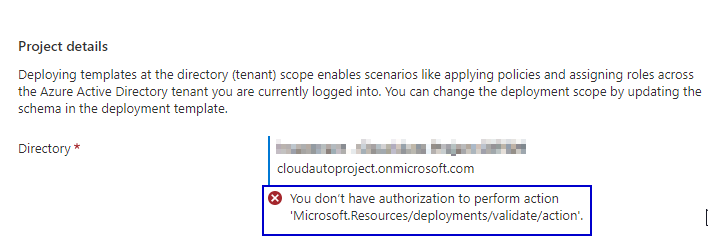
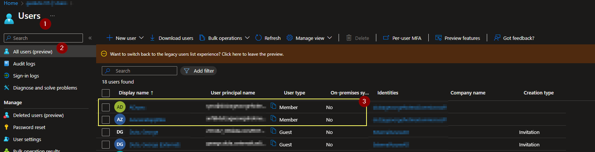
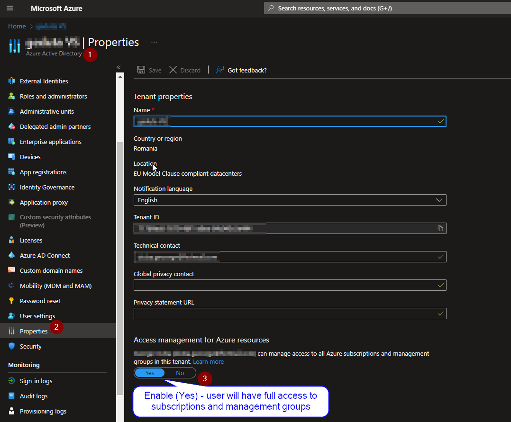
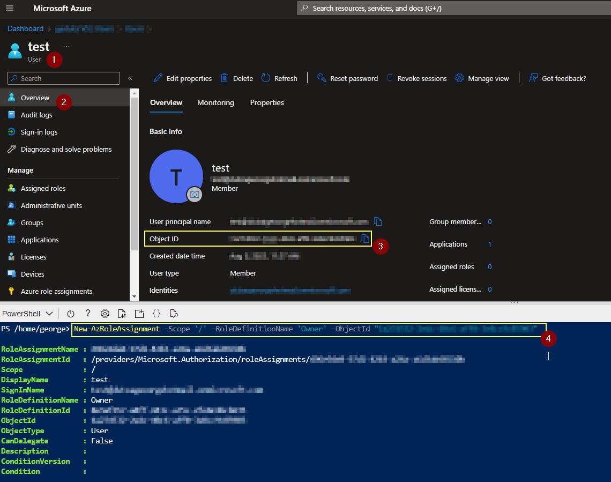

## 1. Azure landing zone accelerator using Azure Portal Cutom Template <br/>
1.1 [](https://portal.azure.com/#create/Microsoft.Template) >   <br/>
1.2 [Documentation](https://learn.microsoft.com/en-us/azure/cloud-adoption-framework/scenarios/cloud-scale-analytics/tutorials/tutorial-create-data-landing-zone) / '[Json template](https://github.com/ge-duta/azure-acp-public/blob/master/Azure%20One-Click%20Deployment/ACP-584%20Azure%20Landing%20Zone%20-%20Custom%20deployment%20-%20ARM%20template/1.LandingZoneAzureARM.json) <br/>
1.3 Demo/ [PPT](https://view.officeapps.live.com/op/view.aspx?src=https%3A%2F%2Fraw.githubusercontent.com%2Fge-duta%2Fazure-acp-public%2Fmaster%2FAzure%2520One-Click%2520Deployment%2FACP-584%2520Azure%2520Landing%2520Zone%2520-%2520Custom%2520deployment%2520-%2520ARM%2520template%2FACP-584%2520AZ%2520Landing%2520Zone%2520ARM.pptx&wdOrigin=BROWSELINK)  <br/>


## 2. Microsoft Cloud Adoption Framework using Azure Blueprints <br/>
2.1 [](https://portal.azure.com/#view/Microsoft_Azure_Policy/CreateEditBlueprintsBlade) >   <br/>
2.2 [Documentation](https://aka.ms/asbf-blueprint)  
2.3 Demo/ [PowerPoint PPT](https://view.officeapps.live.com/op/view.aspx?src=https%3A%2F%2Fraw.githubusercontent.com%2Fge-duta%2Fazure-acp-public%2Fmaster%2FAzure%2520One-Click%2520Deployment%2FACP-584%2520Azure%2520Landing%2520Zone%2520-%2520Custom%2520deployment%2520-%2520ARM%2520template%2FACP-584%2520AZ%2520Landing%2520Zone%2520ARM.pptx&wdOrigin=BROWSELINK)  <br/>  


## 3. Deploy Enterprise-scale using ARM custom template <br/>
3.1 [](https://portal.azure.com/#blade/Microsoft_Azure_CreateUIDef/CustomDeploymentBlade/uri/https%3A%2F%2Fraw.githubusercontent.com%2FAzure%2FEnterprise-Scale%2Fmain%2Fdocs%2Freference%2Ftreyresearch%2FarmTemplates%2Fes-lite.json/createUIDefinitionUri/https%3A%2F%2Fraw.githubusercontent.com%2FAzure%2FEnterprise-Scale%2Fmain%2Fdocs%2Freference%2Ftreyresearch%2FarmTemplates%2Fportal-es-lite.json)    
3.2 [Documentation](https://github.com/Azure/Enterprise-Scale/tree/main/docs/reference/treyresearch#readme) / [Json Template](https://github.com/ge-duta/azure-acp-public/blob/master/Azure%20One-Click%20Deployment/ACP-584%20Azure%20Landing%20Zone%20-%20Custom%20deployment%20-%20ARM%20template/3.LandingZoneTemplateCustomARM.json)
3.3 Demo/ [Summary Presentation PPT](https://view.officeapps.live.com/op/view.aspx?src=https%3A%2F%2Fraw.githubusercontent.com%2Fge-duta%2Fazure-acp-public%2Fmaster%2FAzure%2520One-Click%2520Deployment%2FACP-584%2520Azure%2520Landing%2520Zone%2520-%2520Custom%2520deployment%2520-%2520ARM%2520template%2FACP-584%2520AZ%2520Landing%2520Zone%2520ARM.pptx&wdOrigin=BROWSELINK)  <br/>  
 

## 4. [Other landing zones implementation options](https://learn.microsoft.com/en-us/azure/cloud-adoption-framework/ready/landing-zone/implementation-options)

## Permissions 
User without correct permissions will receive:  
  <br/>

Mitigation:
a. Please use an identity that is local to the Azure AD, and not Guest user account due to known restrictions.
  <br/>
b. Please provide full access to subscriptions and management group. [More Details](https://github.com/ge-duta/azure-acp-public/blob/master/Azure%20One-Click%20Deployment/ACP-584%20Azure%20Landing%20Zone%20-%20Custom%20deployment%20-%20ARM%20template/ConfigurePermissions.md)
  <br/>

c. Grant Access to User at root scope "/" using Azure Cloud Shell:

```powershell
New-AzRoleAssignment -Scope '/' -RoleDefinitionName 'Owner' -ObjectId "userObjecID from Azure AD"
```
  <br/>
