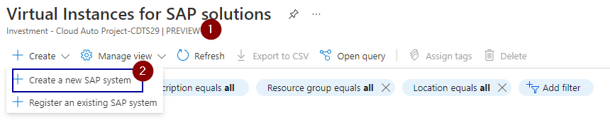

## 1. Deploy S/4HANA infrastructure with Azure Center for SAP solutions  
1.1 [](https://portal.azure.com/#view/Microsoft_Azure_SAPManagement/CreateSVI.ReactView/_provisioningContext~/%7B%22initialValues%22%3A%7B%22subscriptionIds%22%3A%5B%220c08f7e9-e572-4fca-b0ca-b9acf0eeda26%22%5D%2C%22resourceGroupNames%22%3A%5B%5D%2C%22locationNames%22%3A%5B%22eastus%22%5D%7D%2C%22telemetryId%22%3A%227c6024be-8a6a-4d1f-ae75-0ce283937054%22%2C%22marketplaceItem%22%3A%7B%22categoryIds%22%3A%5B%5D%2C%22id%22%3A%22Microsoft.Portal%22%2C%22itemDisplayName%22%3A%22NoMarketplace%22%2C%22products%22%3A%5B%5D%2C%22version%22%3A%22%22%2C%22productsWithNoPricing%22%3A%5B%5D%2C%22publisherDisplayName%22%3A%22Microsoft.Portal%22%2C%22deploymentName%22%3A%22NoMarketplace%22%2C%22launchingContext%22%3A%7B%22telemetryId%22%3A%227c6024be-8a6a-4d1f-ae75-0ce283937054%22%2C%22source%22%3A%5B%22BrowseResource%22%2C%22%7B%20Name%3A%20Part%2C%20Type%3A%20%5B0%5DHubsExtension-%5B1%5DBrowseResource-%5B2%5DTemplateBladeVirtualLens-%5B5%5DBrowseResource%2C%20Id%3A%20Part-BrowseResource-1%20%7D%22%2C%22Part-BrowseResource-1%22%5D%2C%22galleryItemId%22%3A%22%22%7D%2C%22deploymentTemplateFileUris%22%3A%7B%7D%2C%22uiMetadata%22%3Anull%7D%7D) >    
1.2 [Documentation](https://learn.microsoft.com/en-us/azure/center-sap-solutions/deploy-s4hana) / '[Json template](https://github.com/)  
1.3 Demo/ [PPT](https://nttdatagroup.sharepoint.com/teams/SRVS-COMM-FS-CDTS-CloudPratices/Shared%20Documents/Forms/AllItems.aspx?id=%2Fteams%2FSRVS%2DCOMM%2DFS%2DCDTS%2DCloudPratices%2FShared%20Documents%2FAutomation%20Project%2FDocuments%2FAzure%2FACP%2D499%20SAP%20HANA%20on%20Azure%2FACP%2D501%20Deploy%20Resource%20Groups%20and%20VMs%20in%20Availability%20Zones%20%283%2DTier%2C%20ASCS%2C%20App%20and%20DB%29&viewid=9ebf676b%2D357d%2D4fa7%2Da84d%2D68f655d0627f)   
